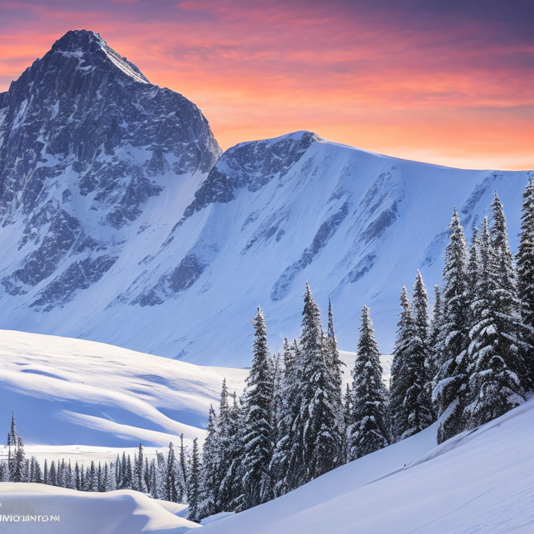
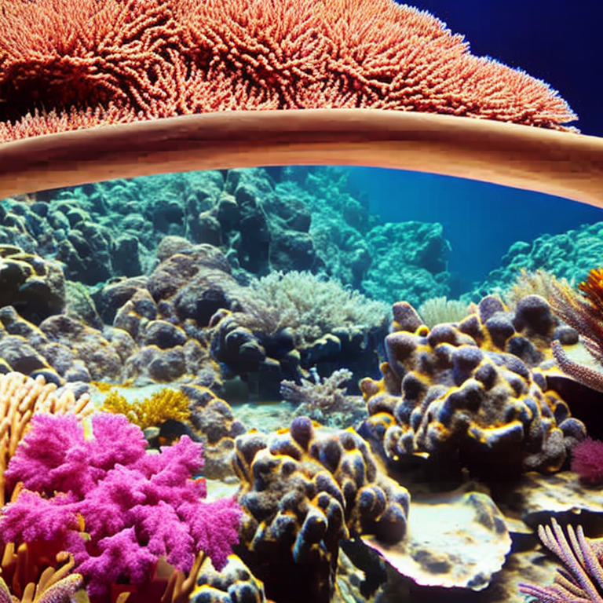
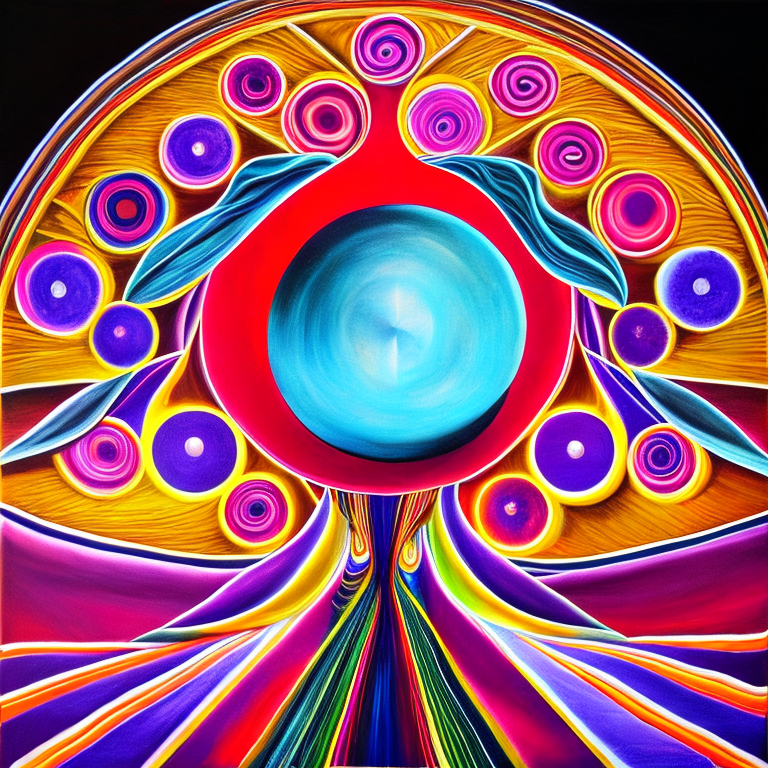

If unable to open the notebook, try this link:
https://colab.research.google.com/drive/1KiCkPQu5jt1VOQXZ42hpqg94VsL19LgD?usp=sharing

Text-to-Image Generator
This project leverages generative AI to create high-quality images from text prompts using the Stable Diffusion model, deployed as an interactive Streamlit web application on Google Colab. It features dynamic prompt enhancement for realistic and vibrant outputs, user-controlled filters for customization, and seamless image storage on Google Drive. The app is publicly accessible via ngrok, making it a robust demonstration of AI-driven creativity and web development.

Purpose
The Text-to-Image Generator enables users to input text prompts (e.g., "a cat walking on the moon") and generate visually stunning images tailored to specific styles, such as sci-fi, fantasy, or nature. Built to showcase generative AI capabilities, it provides an intuitive interface for experimenting with prompt engineering, image quality settings, and cloud-based deployment, ideal for AI enthusiasts and developers.

How It Was Built
The project was developed in Google Colab with a GPU runtime, structured across multiple stages:

Setup: Installed dependencies (diffusers, transformers, torch, streamlit, pyngrok, pillow) and mounted Google Drive for image storage.
Core Functionality: Integrated the Stable Diffusion model with PyTorch and Diffusers for GPU-accelerated image generation. Developed enhance_prompt() to dynamically augment prompts with context-aware styles (e.g., hyper-realistic, cinematic lighting).
Streamlit Interface: Built an interactive Streamlit app with user controls for prompt input, number of inference steps, guidance scale, negative prompt, and resolution (512x512, 768x768). Added robust error handling for image saving and parameter validation.
Deployment: Used ngrok to expose the app publicly, enabling real-time testing. Enhanced the app with Google Drive integration for saving generated images.

Key technologies include:

Stable Diffusion: For generative AI image synthesis.
Streamlit: For the web interface.
PyTorch & Diffusers: For model execution and optimization.
Google Colab & ngrok: For cloud hosting and public access.
Python: For scripting and logic, including enhance_prompt() and generate_image().

Screenshots and Example Prompts
The following images were generated using the app, showcasing its ability to handle diverse prompts with enhanced styles:

**Futuristic City at Night**

**Majestic Snow-Covered Mountain**

**Steampunk Airship**

**Underwater Coral Reef**

**Vintage Car in Desert**

**Abstract Art**

Streamlit UI: The interactive interface for prompt input and filter customization.

How to Run
Follow these steps to run the project in Google Colab:

Open the Notebook:
Upload Text_to_Image.ipynb to Google Colab.
Ensure a GPU runtime is selected: Runtime > Change runtime type > GPU.

Install Dependencies and Mount Drive:
Run the Setup cell to install required libraries and mount Google Drive:!pip install diffusers transformers torch streamlit pillow pyngrok
from google.colab import drive
drive.mount('/content/drive')

Run the Streamlit App:

Run the Streamlit Interface cells to set up the Streamlit app and ngrok tunnel:
In the second Streamlit Interface cell, replace YOUR_NGROK_AUTHTOKEN with your ngrok authtoken (get it from ngrok.com).
Execute the cells to launch the app and generate a public ngrok URL (e.g., https://<ngrok-id>.ngrok-free.app).

Use the App:

Open the ngrok URL in a browser.
Enter a prompt (e.g., a cat walking on the moon), adjust filters (guidance scale, negative prompt, resolution), and click "Generate Image."
View the generated image in the app and check /content/drive/MyDrive/Text_to_Image_Outputs for saved images.

Stop the App:

Interrupt the ngrok cell (Ctrl+C or stop button) to shut down Streamlit and ngrok cleanly.

Files

Text_to_Image.ipynb: Jupyter notebook with all project code, markdown, and documentation.
app.py: Streamlit app script generated for the web interface.
screenshots/: Folder containing generated images and Streamlit UI screenshot.

Requirements

Google Colab with GPU runtime
Libraries: streamlit, diffusers, transformers, torch, pillow, pyngrok
Ngrok account and authtoken
Google Drive for image storage

Notes

Google Drive: Ensure Drive is mounted to save images to /content/drive/MyDrive/Text_to_Image_Outputs.
GPU Memory: If you encounter memory errors, reduce resolution to 512x512 or lower num_inference_steps to 25.
Ngrok: URLs are temporary; re-run the Streamlit Interface ngrok cell for a new URL.
Troubleshooting:
For ModuleNotFoundError, re-run the Day 1 cell.
Check Colab output for image save errors or GPU issues (!nvidia-smi).

Future Enhancements

Deploy to Streamlit Cloud for persistent hosting.
Add style presets (e.g., anime, oil painting) to enhance_prompt().
Optimize for local CPU execution in PyCharm for non-GPU environments.
Integrate additional models or advanced prompt engineering techniques.

